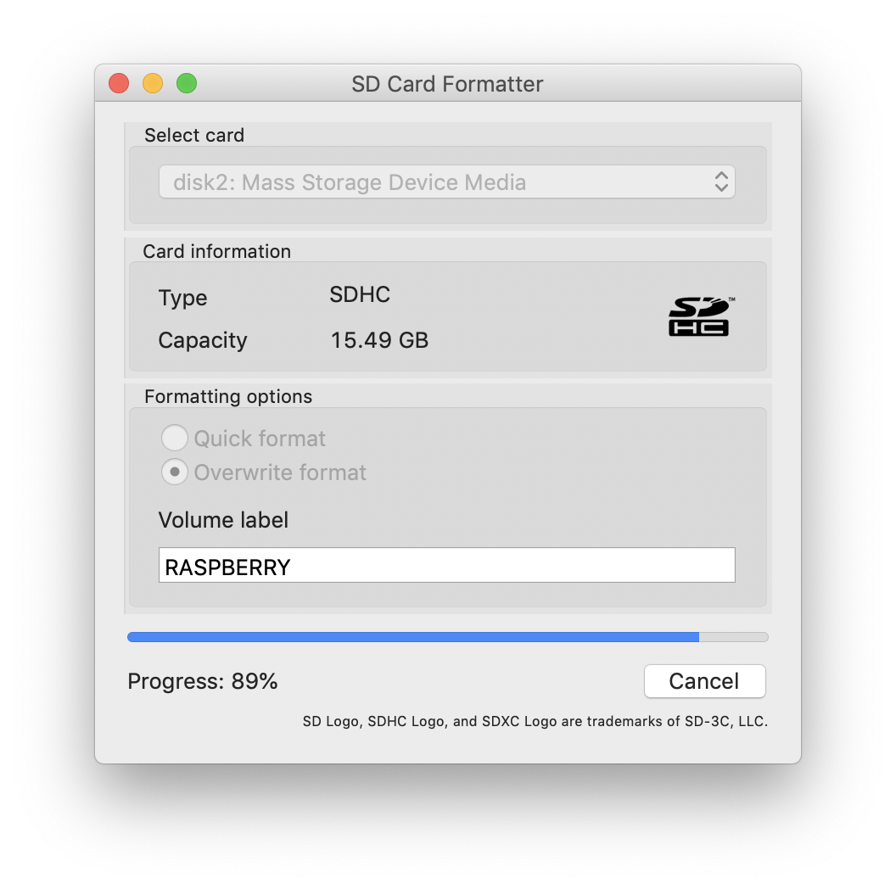
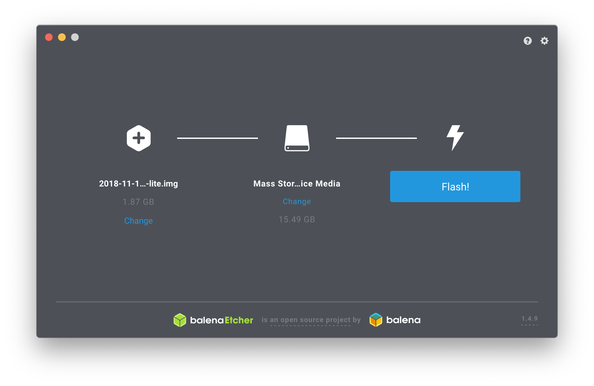
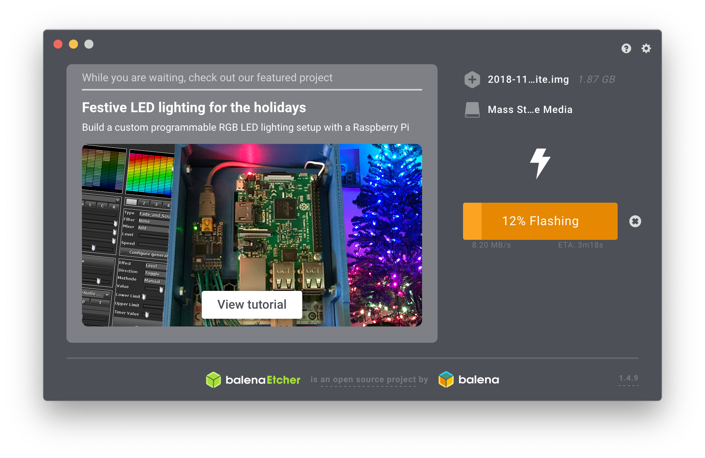

Pi Unifi Controller
===================

This project intend to automatically deploy UniFi Controller v5 to Raspberry Pi.

Prerequisites
-------------

A Raspberry Pi provisioned with Raspbian.
See [Raspberry Quick Start Guide](http://www.raspberrypi.org/qsg) or [Quick Start Offline Version](files/qsg.pdf)

### How to setup the Raspberry Pi from OSX

#### GUI

- Install SD Card Formatter
```
$ brew cask install sdformatter
```

- Format SD Card as FAT32
Launch "SD Card Formatter"
Choose "Overwrite Format", fill "Volume Label"



- Download Raspbian Image
https://www.raspberrypi.org/downloads/raspbian/

- Install Balena Etcher
```
$ brew cask install balenaetcher
```

- Install Raspbian image using Balena Etcher
Choose Image
Choose SD Card drive
Flash!





#### Command Line

- Format SD card as FAT32
```
$ diskutil list
$ sudo diskutil eraseDisk FAT32 <volume name> MBRFormat /dev/disk<disk# from diskutil>
```

- Unmount SD card
```
$ diskutil unmountDisk /dev/disk<disk# from diskutil>
```

- Copy the data to your SD card
```
$ sudo dd bs=1m if=image.img of=/dev/disk<disk# from diskutil>
```

- After the `dd` command finishes, eject the card
```
$ sudo diskutil eject /dev/disk<disk# from diskutil>
```

### Configure SSH on Raspbian
https://www.raspberrypi.org/documentation/remote-access/ssh/

- By default, ssh is deactivated on raspbian, to enable it 
create an empty `ssh` file at the root of the `boot` partition 

- Find the raspberry with (you can install nmap with macports)
```
$ sudo nmap -sP <192.168.1 (local network ip)>.0/24
```

- Ensure to succeed connecting to the default raspberry account using
```
ssh pi@raspberrypi
password: raspberry 
```

Usage
-----

### Initialize raspberry

 - Drop your public ssh key in ssh-keys/files/enabled
 - Run prepare.yml playbook with default pi user
 
    ansible-playbook -i inventories/hosts prepare.yml -e ansible_ssh_user=pi -e ansible_ssh_pass=raspberry

### Deploy UniFi Controller

 - Run deploy playbook with previously provisioned ansible user.
    
    ansible-playbook -i inventories/hosts deploy.yml

TODO
----

 - Disable pi user ssh authentication
 - Configure firewall
 - Configure reverse proxy 
